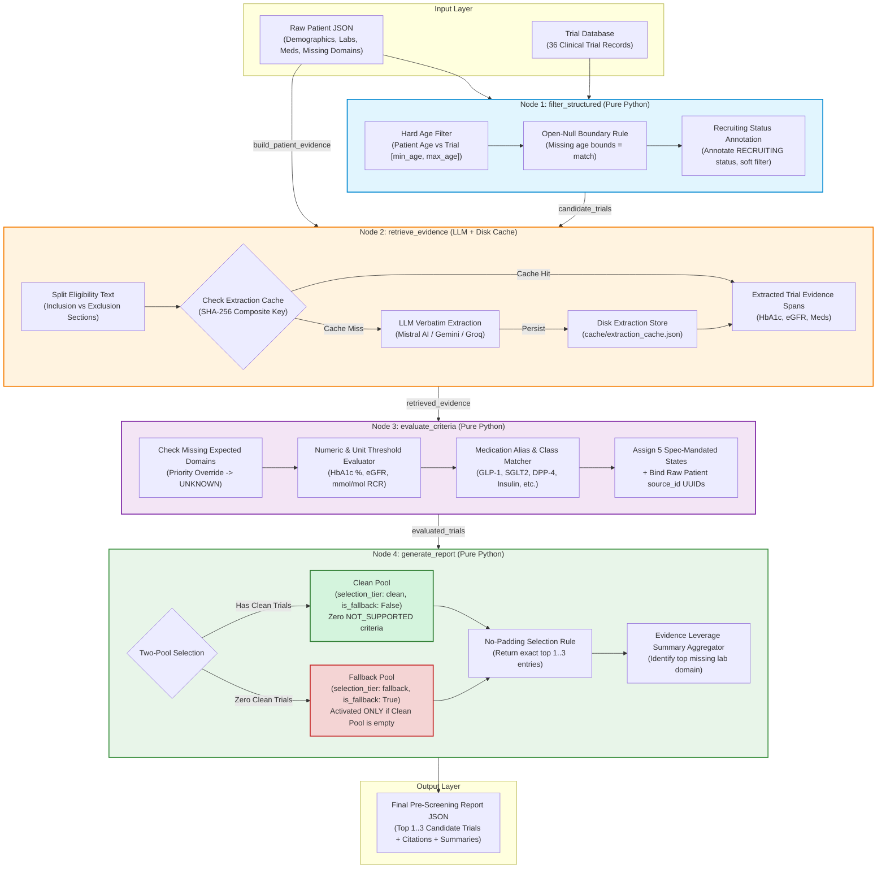
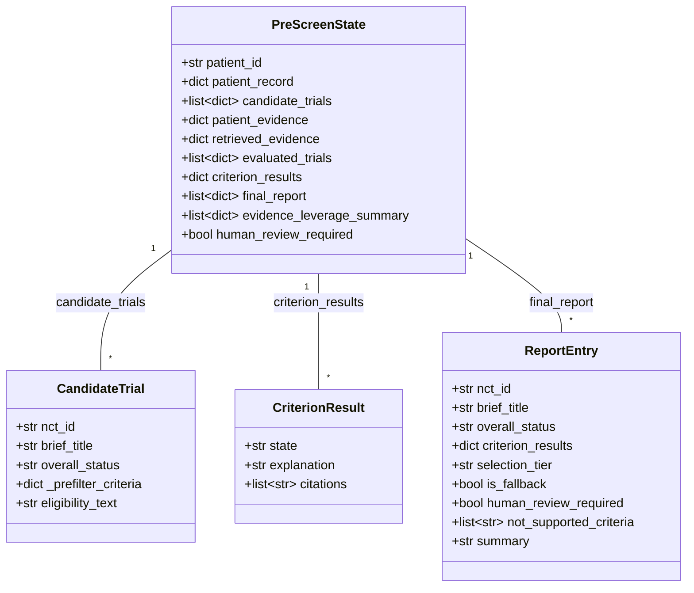
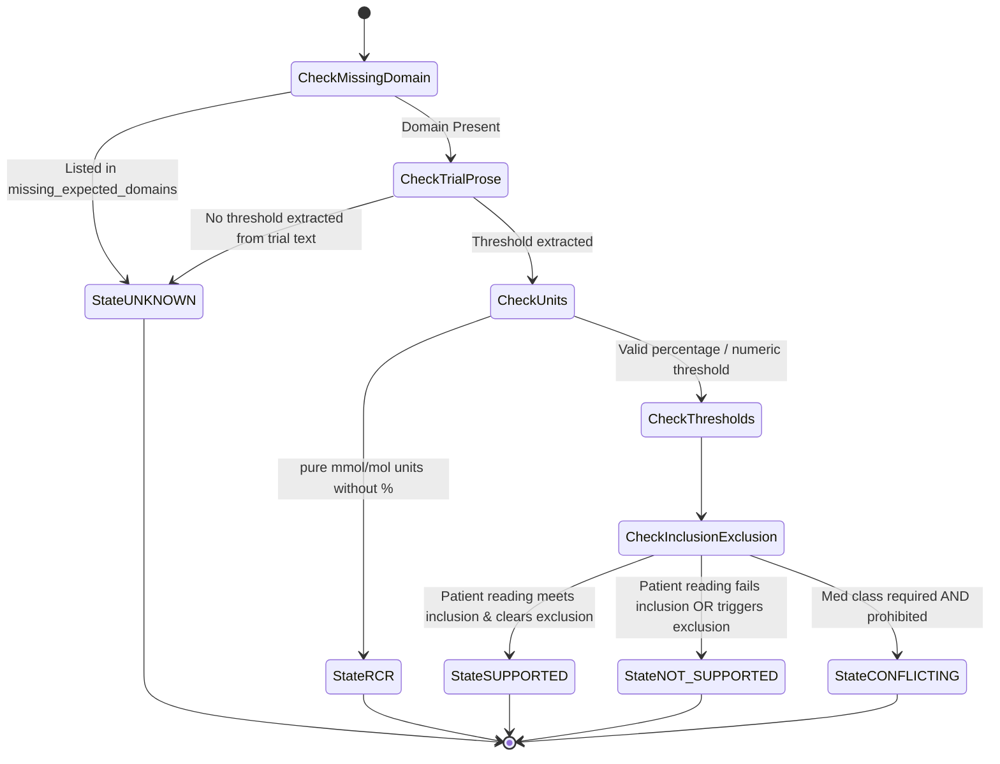
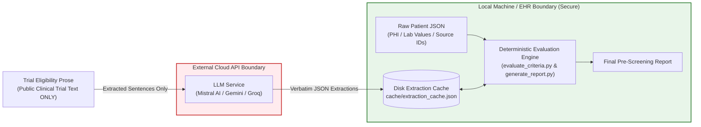

# System Architecture & Design Specification

> **Type 2 Diabetes Trial Pre-Screening Agent**  
> *Built with LangGraph, Python 3.10+, and provider-agnostic LLM extraction.*

---

## 1. Executive Summary & Design Philosophy

Clinical trial pre-screening requires reconciling complex, dated patient electronic health records (EHR) against dense, unstructured trial eligibility prose. Standard LLM approaches attempt end-to-end evaluation in a single prompt, leading to critical failure modes: hallucinated criteria, fabricated patient observation IDs, and ungrounded pass/fail determinations.

This system addresses those failure modes by enforcing a **hybrid deterministic-agentic architecture**:
- **Strict Separation of Concerns**: LLMs are restricted *exclusively* to verbatim evidence extraction from trial prose. All decision-making, threshold comparison, unit checking, state assignment, and candidate ranking are performed by pure, deterministic Python state engines.
- **100% Citation Traceability**: Every evaluated criterion result binds directly to exact raw patient `source_id` UUIDs from the patient's record.
- **Honest Uncertainty**: Missing patient data or unmentioned trial criteria evaluate to `UNKNOWN`—absence is never converted into a fake pass or fail.
- **Zero Patient Data Leakage**: Patient data never leaves the local machine. Only unstructured trial eligibility prose is sent to the extraction LLM.

---

## 2. End-to-End Pipeline Architecture

The agent is implemented as a linear 4-node **LangGraph** execution graph (`prescreener/graph.py`).

---

## 3. State Schema & Data Transformation Map

The graph state (`PreScreenState`) is a typed, JSON-serializable dictionary (`prescreener/state.py`) threaded through all four nodes.

---

## 4. Node Specifications & Internal Logic

### Node 1: `filter_structured` (Pure Python)
- **Inputs**: Raw `patient_record` JSON and complete trial list (36 trials).
- **Hard Filter**: Computes patient age from `birth_date` against trial `minimum_age` and `maximum_age`. Open/null boundaries allow matching.
- **Soft Annotation**: Preserves trial `overall_status` (e.g. `RECRUITING`, `COMPLETED`, `UNKNOWN`) without hard exclusion, annotating it for Node 3 evaluation.
- **Output**: `candidate_trials` (~21 to 33 candidate trials per patient).

### Node 2: `retrieve_evidence` (Provider-Agnostic LLM + Caching)
- **Inputs**: `candidate_trials` and structured `patient_evidence`.
- **Extraction Function**: Sends *only* trial eligibility prose to the LLM (Mistral AI `mistral-small-latest`, Gemini `gemini-3.6-flash`, or Groq `llama-3.3-70b-versatile`).
- **Prompt Engineering**: Restricts output to verbatim extracted sentences for:
  1. HbA1c thresholds and ranges
  2. Diabetes medication names/classes
  3. eGFR and renal function limits
- **Operator Preservation**: Strict prompt constraint enforcing operator exactness (`≤` stays `≤`, `≥` stays `≥`).
- **Composite Cache Layer**: Composite key `SHA256(nct_id + eligibility_text + version)` checked against disk store (`cache/extraction_cache.json`).
- **Retry Mechanism**: Exponential backoff on HTTP 429/5xx status codes with `Retry-After` header parsing.

### Node 3: `evaluate_criteria` (Pure Python State Engine)
- **Inputs**: `patient_evidence` and `retrieved_evidence`.
- **5 Spec-Mandated States**:
  - `SUPPORTED`: Patient fact satisfies criterion (cites patient `source_id` + text span).
  - `NOT_SUPPORTED`: Patient fact fails criterion (cites patient `source_id` + text span).
  - `UNKNOWN`: Missing data in `missing_expected_domains` OR absent trial thresholds.
  - `CONFLICTING_EVIDENCE`: Structurally contradictory drug inclusion/exclusion requirements.
  - `REQUIRES_CLINICAL_REVIEW`: Pure `mmol/mol` units without `%`, or unclassified `other_requirements`.
- **Precedence Rule**: Listed `missing_expected_domains` immediately triggers `UNKNOWN` before threshold parsing.

### Node 4: `generate_report` (Two-Pool Ranker & Leverage Summary)
- **Two-Pool Ranking Architecture**:
  - **Clean Pool (`selection_tier: "clean"`, `is_fallback: False`)**: Trials with zero `NOT_SUPPORTED` criteria. Ranked by fewest `UNKNOWN` → fewest `REQUIRES_CLINICAL_REVIEW` → `RECRUITING` status.
  - **Fallback Pool (`selection_tier: "fallback"`, `is_fallback: True`)**: Activated **only** if Clean Pool contains 0 trials. Returns top 3 fallback entries flagged with `human_review_required: True`.
- **No-Padding Rule**: If Clean Pool has 1 or 2 trials, returns exactly 1 or 2 entries. Disqualified trials are never used as padding.
- **Evidence Leverage Summary**: Scans all evaluated candidate trials for `UNKNOWN` states, identifies the single missing lab domain affecting the most trials, and emits a top-level coordinator summary statement.

---

## 5. Criterion State Machine Diagram

The state transitions for every individual trial criterion follow strict priority rules:

---

## 6. Data Privacy & Network Security Boundary

The system maintains a strict air-gapped security boundary between sensitive patient EHR data and external LLM APIs.

---

## 7. Verification & Metric Architecture

The system's correctness is validated across four independent, non-overlapping verification harnesses:

| Harness File | Purpose & Focus | Execution Command | Result |
|---|---|---|---|
| `pytest` | Native test suite runner over `test_eval_suite.py` | `pytest` | **10/10 PASS** |
| `test_eval_suite.py` | 10-case deterministic edge case suite | `python test_eval_suite.py` | **10/10 PASS** |
| `test_original_metric.py` | Citation Traceability & Hallucination Gap Index (CTHGI) across all 15 patients | `python test_original_metric.py` | **100.00% CTHGI / PASS** |
| `verify_P3098.py` | Hand-verification script checking 5 structural constraints on output JSON | `python verify_P3098.py examples/output_P3098.json` | **All 5 Checks PASS** |

---

## 8. Summary of Architectural Guarantees

1. **Deterministic Reproducibility**: 3 out of 4 graph nodes are pure, deterministic Python functions.
2. **Zero False Positives from Missing Data**: `UNKNOWN` state priority ensures absent labs never produce false passes or fails.
3. **Traceable Audit Trail**: Every criterion state contains explicit array citations referencing raw patient `source_id` UUIDs.
4. **Resilient Operation**: Disk-based composite SHA-256 caching ensures zero redundant API calls and instant offline execution for cached trials.
