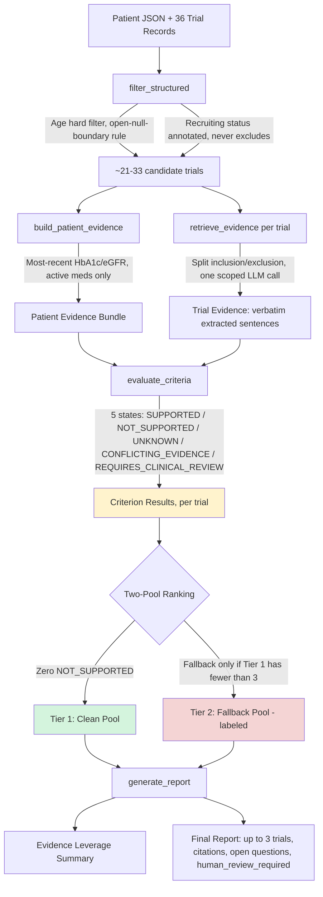

# Type 2 Diabetes Trial Pre-Screening Agent

A node-graph clinical agent (built with **LangGraph**) that reconciles dated patient history against unstructured clinical-trial eligibility prose, producing an inspectable pre-screening report. 

Every criterion result cites a `source_id` from the raw patient JSON; every unknown is declared; missing data is never turned into a fake pass or fail.

See [RESEARCH.md](./RESEARCH.md) for problem framing, data schema, and design decisions.  
See [AI_USAGE.md](./AI_USAGE.md) for AI-driven design iteration and trade-off notes.  
See [summary_all_patients.md](./summary_all_patients.md) for the batch pre-screening report across all 15 dataset patients.  
See [DEMO_RUNS.md](./DEMO_RUNS.md) for actual terminal execution logs and outputs.

---

## Why this project

Clinical trial recruitment is one of the slowest parts of medical research —
research coordinators spend real hours manually cross-checking patient
records against eligibility criteria written in dense, inconsistent prose,
for every trial, for every patient. That's not just a systems problem; it's
time that could go toward actual patient care, and delays here can mean
promising treatments take longer to reach the people who need them.

This project isn't trying to replace that judgment — the assignment is
explicit that a human makes the final call, and this system is built
around that constraint rather than against it. What it's built to do is
remove the tedious first pass: read the messy paragraphs, check the dated
lab values, and hand a coordinator a short, honestly-uncertain shortlist
instead of 36 trials to read cover to cover. Every design decision in this
build — the two-tier ranking, the "no data means UNKNOWN, never a guess"
rule, the evidence citations on every claim — comes back to the same idea:
a tool that's useful in a clinical setting has to be honest about what it
doesn't know before it can be trusted with what it does.

---

## Quick Start & CLI Entry Point (`main.py`)

### 1. Set your API Key (Supports Mistral AI, Google Gemini, or Groq)
```bash
# Option 1: Mistral AI (Recommended — Fast, high rate limits)
export MISTRAL_API_KEY="your_api_key_here"

# Option 2: Google Gemini API
export GEMINI_API_KEY="your_api_key_here"

# Option 3: Groq API
export GROQ_API_KEY="your_api_key_here"
```
*(On Windows PowerShell, use `$env:MISTRAL_API_KEY = "your_key"`)*

### 2. Run the Agent via CLI

```bash
# List all patients in the dataset with age, active meds count, and missing domains
python main.py --list-patients

# Run full pre-screening for one patient and print readable report
python main.py --patient P-3098

# Save full JSON output report to a file
python main.py --patient P-3098 --out output_P3098.json

# Run summarized batch pre-screening for all 15 patients in sequence
python main.py --all

# Enable per-stage LangGraph state logging
python main.py --patient P-3098 --verbose

# Bypass disk cache to force fresh LLM API calls for every candidate trial
python main.py --patient P-3098 --no-cache
```

### 3. Run Test & Verification Suites (Offline — Instant)
```bash
# Run native pytest runner (10/10 PASS)
pytest

# Run the 10-Case Evaluation Suite (deterministic unit test harness)
python test_eval_suite.py

# Run the Original Metric Suite (Citation Traceability & Hallucination Gap Index across all 15 patients)
python test_original_metric.py

# Run Hand-Verification Suite against output JSON
python verify_P3098.py output_P3098_mistral.json
```

---

## Architecture

Linear 4-Stage LangGraph pipeline (`prescreener/graph.py`):

```
START → filter_structured → retrieve_evidence → evaluate_criteria → generate_report → END
```

| Node | LLM? | Output |
|---|---|---|
| `filter_structured` | ✗ (Pure Python) | `candidate_trials` (hard age filter, soft recruiting status annotation) |
| `retrieve_evidence` | ✓ (1 call / trial) | `retrieved_evidence` (verbatim extraction of HbA1c, eGFR, meds spans) |
| `evaluate_criteria` | ✗ (Pure Python) | `criterion_results`, `human_review_required` (5 spec-mandated states + citations) |
| `generate_report`   | ✗ (Pure Python) | `final_report` (two-pool ranking, `selection_tier: clean/fallback`, summary, `evidence_leverage_summary`) |



---

## Criterion States

Five states mandated by `assignment_scope.required_criterion_states`:

| State | Meaning & Usage |
|---|---|
| `SUPPORTED` | Patient fact meets criterion (cites patient `source_id` + text span) |
| `NOT_SUPPORTED` | Patient fact fails criterion (cites patient `source_id` + text span) |
| `UNKNOWN` | Required domain listed in `record_quality.missing_expected_domains` or no trial threshold extracted |
| `CONFLICTING_EVIDENCE` | Structurally contradictory facts (e.g. drug class required AND prohibited) |
| `REQUIRES_CLINICAL_REVIEW` | Pure `mmol/mol` units without `%`, or free-text `other_requirements` |

---

## Production Resilience & Disk-Based Extraction Cache

- **In-Memory Cache Buffer**: `cache/extraction_cache.json` is loaded into memory (`_CACHE_STORE`) once per session, eliminating redundant file I/O operations while persisting new extractions to disk.
- **Composite Cache Key**: SHA-256 hash of `(nct_id, eligibility_text, PROMPT_TEMPLATE_VERSION)`. If trial prose or prompt version changes, the cache automatically invalidates and recomputes.
- **Automatic HTTP Retry & Backoff**: All LLM calls (Mistral AI, Groq, Gemini) feature exponential backoff retry loops with `Retry-After` header parsing for HTTP 429/5xx status codes.
- **Compiled Graph Reuse**: Compiled `StateGraph` instances are cached in memory across runner calls to eliminate redundant graph compilation overhead.
- **Bypass Flag**: Pass `--no-cache` to force fresh LLM calls without overwriting existing cache entries.

---

## Two-Pool Ranking & Privacy Boundaries

### Two-Pool Ranking Architecture
1. **Clean Pool (`selection_tier: "clean"`)**: Trials with zero `NOT_SUPPORTED` criteria. Ranked by fewest `UNKNOWN` → fewest `REQUIRES_CLINICAL_REVIEW` → `RECRUITING` status.
2. **Fallback Pool (`selection_tier: "fallback"`)**: Activated **only** if zero clean trials exist. Top 3 trials returned with `is_fallback: True` and `human_review_required: True`.
3. **No-Padding Rule**: If 1 or 2 clean trials exist, exactly 1 or 2 entries are returned. Disqualified trials are never pulled in to pad the list.

### Privacy & Data Safety
- **Zero Patient Data Leakage**: Only trial `eligibility_text` is sent to the LLM (one trial per call). No patient IDs, lab values, or medication names ever leave the local machine.
